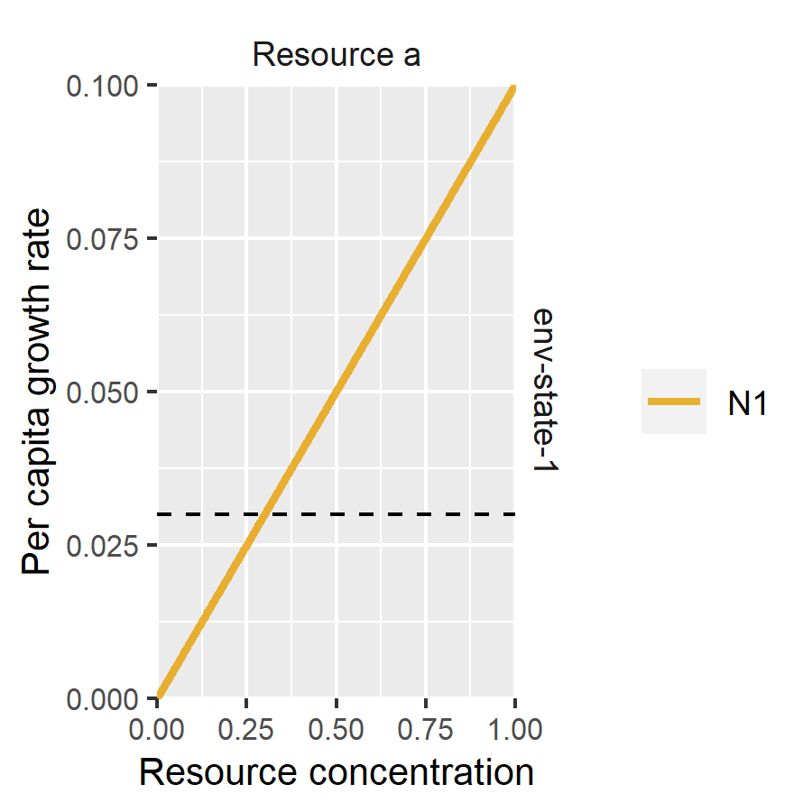
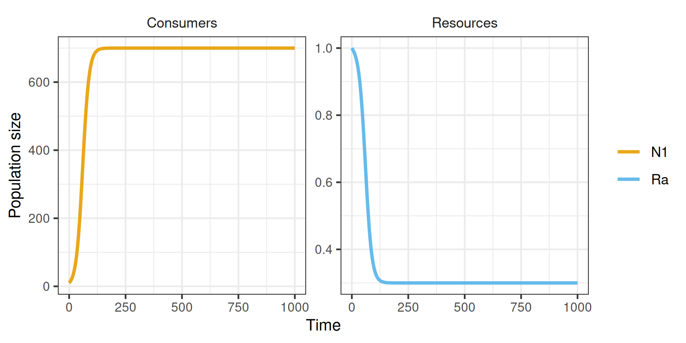
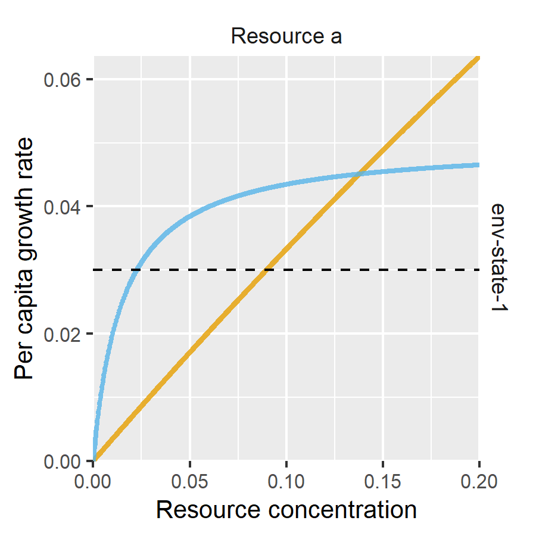
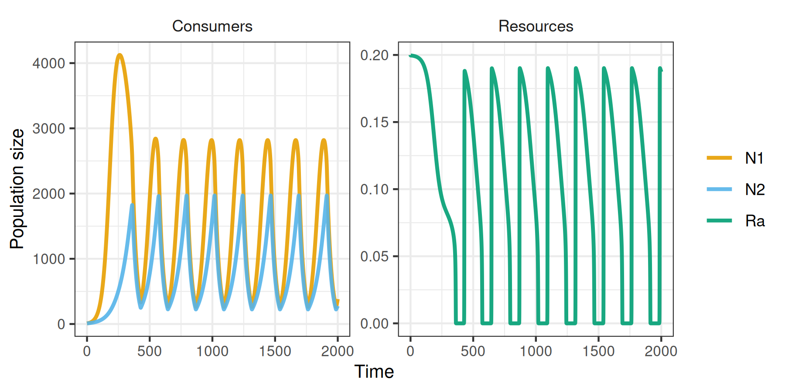
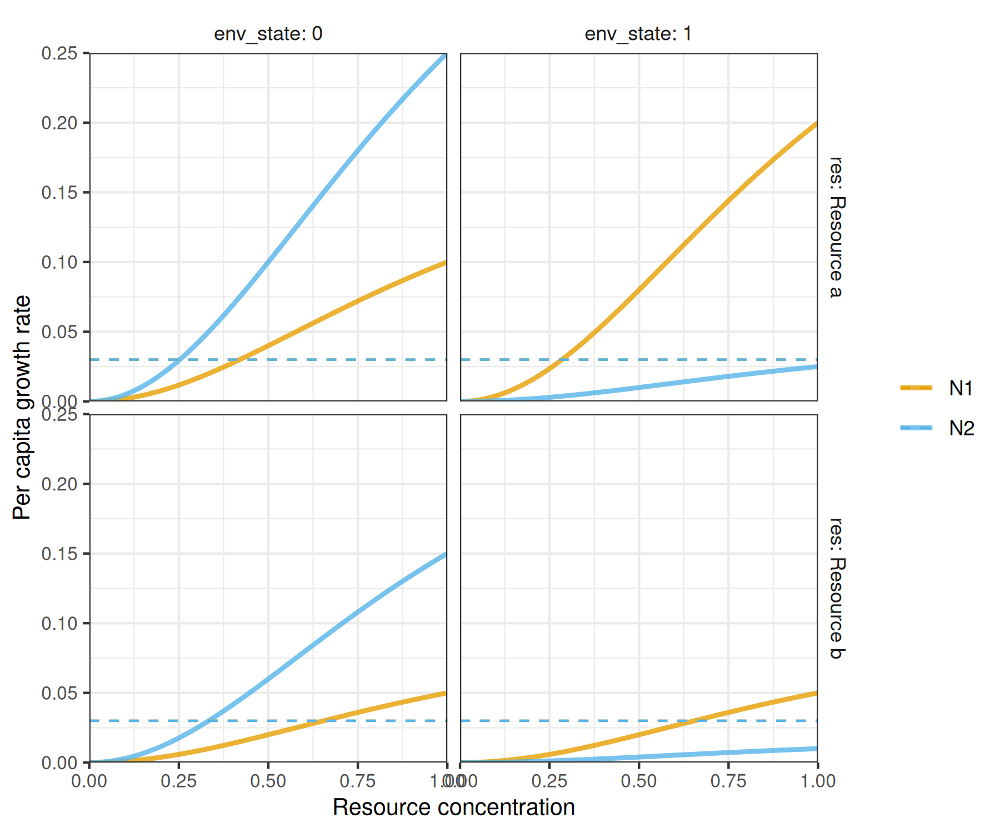
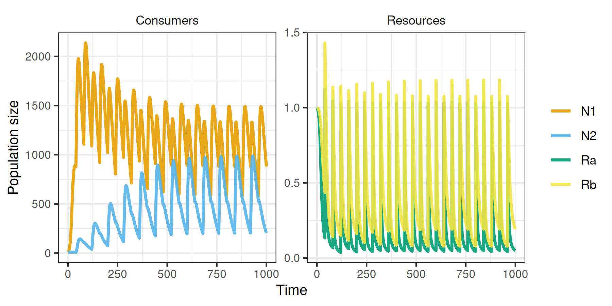

<!-- README.md is generated from README.Rmd. Please edit that file -->

# rescomp

<!-- badges: start -->

[](https://github.com/andrewletten/rescomp/actions)
<!-- badges: end -->

*Disclaimer: `rescomp` is still in the very early stages of development,
with functions, arguments and workflows still liable to change with high
frequency. I have made the repository public in its immature state
primarily for ease of sharing with friends, collaborators and students
during development. Please use with caution and perform your own sanity
checks! Feedback and pull requests very welcome.*

The goal of the R package `rescomp` is to simplify the process of
defining, simulating and visualizing the output of ODE models of
ecological consumer-resource interactions. In essence, it is a
consumer-resource modelling focused interface to the excellent `deSolve`
package.

## Installation

You can install `rescomp` from [GitHub](https://github.com/) with:

``` r
# install.packages("devtools")
devtools::install_github("andrewletten/rescomp")
```

## Example

``` r
library(rescomp)
```

The primary user function in `rescomp` is `spec_rescomp`, which
facilitates i) the definition and parameterisation of a desired
consumer-resource model, and ii) the specification of simulation
parameters. The default output from `spec_rescomp` is a list defining a
model for a single type I consumer (linear functional response) and a
single continuously supplied resource (e.g. in a chemostat).

``` r
pars <- spec_rescomp()
#> Model properties 
#>  * 1 consumer(s) and 1 resource(s)
#>  * Consumers have type 1 functional responses
#>  * Resource supply is continuous (e.g. chemostat)
#>  * Mortality is continuous
#> 
#> Simulation properties 
#>  * Simulation time: 1000 time steps
#>  * Init state: consumer(s) = [10], resource(s) = [1]
```

`rescomp::funcresp` plots the functional response for easy visualistion
prior to running a simulation.

``` r
plot_funcresp(pars)
```



<!-- `rescomp::time_vals` sets the simulation length (and other resource pulse frequency if required). The default simulation length is 1000. The function `initiate_state` sets the starting values of state variables defaulting to 10 for consumers and the resource supply concentration for resources.  -->

The model is then simulated via `rescomp::sim_rescomp` (a wrapper for
`deSolve::ode` with convenient defaults).

``` r
m1 <- sim_rescomp(pars)
```

Output dynamics can be visualised with `rescomp::plot_rescomp`.

``` r
plot_rescomp(m1, pars) 
```



The main utility of `rescomp` comes with specifying more elaborate
models and simulation dynamics. Features/options include (but are not
limited to):

-   Number of consumers/resources
-   Consumer functional response (type I, II or III)
-   Resource dynamic (chemostat, logistic and/or pulsed)
-   Resource type (substitutable or essential)
-   Continuous or intermittent mortality (e.g. serial transfer)
-   Time dependent consumption parameters

See `?spec_rescomp` for all argument options.

The following two examples demonstrate how to build and simulate a model
for: i) two consumers with type II functional responses on a single
logistically growing resources; and ii) two consumers with type III
functional responses with pulsed resources and time dependent
consumption parameters. A wide range of other examples can be found in
the package vignette.

### Example 1

``` r
pars <- spec_rescomp(
  spnum = 2, 
  resnum = 1,
  funcresp = "type2",
  mumatrix = list(matrix(c(0.7,0.05), 
                    nrow = 2, 
                    ncol = 1,
                    byrow = TRUE)),
  kmatrix = matrix(c(2, 0.015), 
                   nrow = 2, 
                   ncol = 1, 
                   byrow = TRUE),  
  chemo = FALSE,
  resspeed = 3,
  resconc = 0.2,
  totaltime = 2000
)
#> Model properties 
#>  * 2 consumer(s) and 1 resource(s)
#>  * Consumers have type 2 functional responses
#>  * Resources grow logistically
#>  * Mortality is continuous
#> 
#> Simulation properties 
#>  * Simulation time: 2000 time steps
#>  * Init state: consumer(s) = [10, 10], resource(s) = [0.2]
```

``` r
plot_funcresp(pars, maxx = 0.2)
```



``` r
m2 <- sim_rescomp(pars)
plot_rescomp(m2, pars) 
```



### Example 2

``` r
pars <- spec_rescomp(
  spnum = 2, 
  resnum = 2,
  funcresp = "type3",
  timepars = TRUE,
  timeparfreq = 40,
  mumatrix = list(matrix(c(0.4,0.1,
                           0.05, 0.02), 
                    nrow = 2, 
                    ncol = 2,
                    byrow = TRUE),
                  matrix(c(0.2, 0.1,
                           0.5, 0.3), 
                    nrow = 2, 
                    ncol = 2,
                    byrow = TRUE)),
  resspeed = 0,
  resconc = 1,
  respulse = 1,
  pulsefreq = 40,
  totaltime = 1000
)
#> Model properties 
#>  * 2 consumer(s) and 2 resource(s)
#>  * Consumers have type 3 functional responses
#>  * Resources are substitutable
#>  * Resource supply is pulsed only
#>  * Mortality is continuous
#>  * Time dependent parameters with instantaneous switching every 40 timesteps
#> 
#> Simulation properties 
#>  * Simulation time: 1000 time steps
#>  * Resources pulsing every 40 timesteps
#>  * Init state: consumer(s) = [10, 10], resource(s) = [1, 1]
```

``` r
plot_funcresp(pars, maxx = 1)
```



``` r
m3 <- sim_rescomp(pars)
```

``` r
plot_rescomp(m3, pars) 
```



<!-- Disclaimer: As a biologist with no formal training in software development, I cannot vouch that `rescomp` is 100% bug free, maximally efficient or entirely consistent with 'tidy' principles. I have done my best but please use with caution! -->
