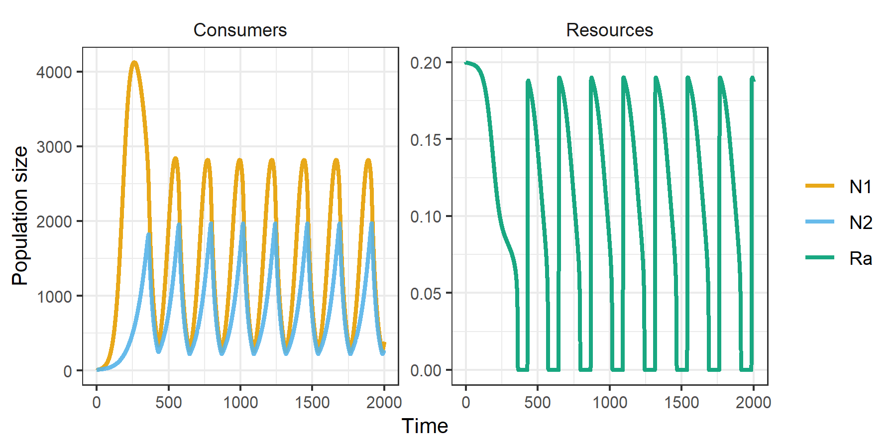
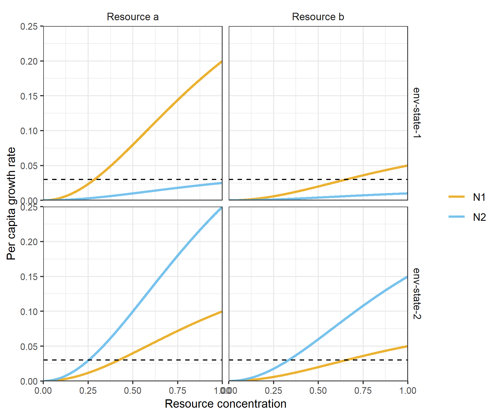
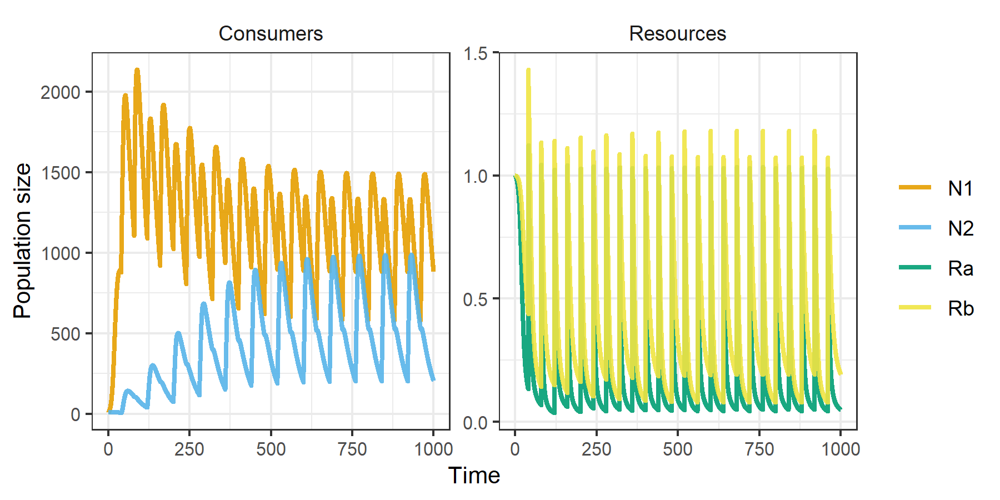

<!-- README.md is generated from README.Rmd. Please edit that file -->

# rescomp

<!-- badges: start -->

[](https://github.com/andrewletten/rescomp/actions)

<!-- badges: end -->

*rescomp* is an R package that supports the definition, simulation and
visualization of ODE models of ecological consumer-resource
interactions. In essence, it is a consumer-resource modelling focused
interface to the excellent *deSolve* package.

## Installation

You can install *rescomp* from [GitHub](https://github.com/) with:

``` r
# install.packages("devtools")
devtools::install_github("andrewletten/rescomp")
```

## Example

``` r
library(rescomp)
```

The primary user function in *rescomp* is `spec_rescomp()`, which
facilitates: i) the definition and parameterisation of a desired
consumer-resource model, and ii) the specification of simulation
parameters. The default output from `spec_rescomp()` is a list defining
a model for a single type I consumer (linear functional response) and a
single continuously supplied resource (e.g., in a chemostat).

``` r
pars <- spec_rescomp()
```

`plot_funcresp()` plots the functional response for easy visualistion
prior to running a simulation.

``` r
plot_funcresp(pars)
```


The model is then simulated via `sim_rescomp()` (effectively a wrapper
for `deSolve::ode()` with convenient defaults).

``` r
m1 <- sim_rescomp(pars)
```

Output dynamics can be visualised with `plot_rescomp()`.

``` r
plot_rescomp(m1)
```

<!-- -->

Note, the core *rescomp* functions are compatible with pipes. For
example `spec_rescomp() |> sim_rescomp() |> plot_rescomp()` will output
the plot above.

The main utility of *rescomp* comes with specifying more elaborate
models and simulation dynamics. Features/options include (but are not
limited to):

  - Unlimited number of consumers/resources
  - Consumer functional response (type I, II or III)
  - Resource dynamic (chemostat, logistic and/or pulsed)
  - Resource type (substitutable or essential)
  - Continuous or intermittent mortality (e.g. serial transfer)
  - Time dependent growth and consumption parameters
  - Delayed consumer introduction times

See `?spec_rescomp` for all argument options.

The following two examples demonstrate how to build and simulate a model
for: i) two consumers with type II functional responses on a single
logistically growing resources; and ii) two consumers with type III
functional responses with pulsed resources and time dependent growth
parameters. A wide range of other examples can be found in the package
vignettes.

### Example 1

``` r
pars <- spec_rescomp(
  spnum = 2,
  resnum = 1,
  funcresp = funcresp_monod(
    mumax = crmatrix(0.7, 0.05),
    ks = crmatrix(2, 0.015)
  ),
  rinit = 0.2,
  ressupply = ressupply_logistic(
    r = 3,
    k = 0.2
  ),
  totaltime = 2000
)
```

``` r
plot_funcresp(pars, maxx = 0.2)
```


``` r
m2 <- sim_rescomp(pars)
plot_rescomp(m2)
```

<!-- -->

### Example 2

``` r
pars <- spec_rescomp(
  spnum = 2,
  resnum = 2,
  funcresp = funcresp_hill(
    mumax = rescomp_coefs_lerp(
      crmatrix(
        0.2, 0.1,
        0.5, 0.3
      ),
      crmatrix(
        0.4, 0.1,
        0.05, 0.02
      ),
      "env_state"
    ),
    ks = crmatrix(1),
    n = crmatrix(2)
  ),
  params = rescomp_param_list(
    env_state = rescomp_param_square(period = 80)
  ),
  ressupply = ressupply_constant(0),
  events = list(
    event_schedule_periodic(
      event_res_add(1),
      period = 40
    )
  ),
  totaltime = 1000
)
```

``` r
plot_funcresp(pars, maxx = 1)
```



``` r
m3 <- sim_rescomp(pars)
```

``` r
plot_rescomp(m3)
```

<!-- -->
