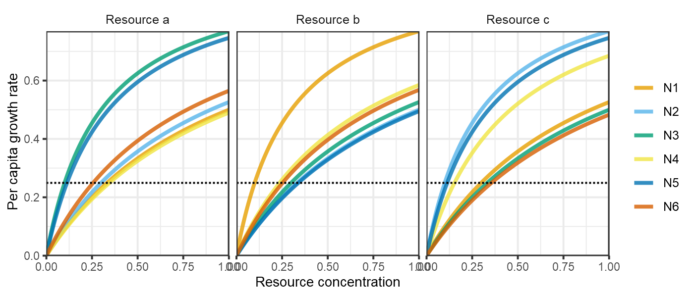
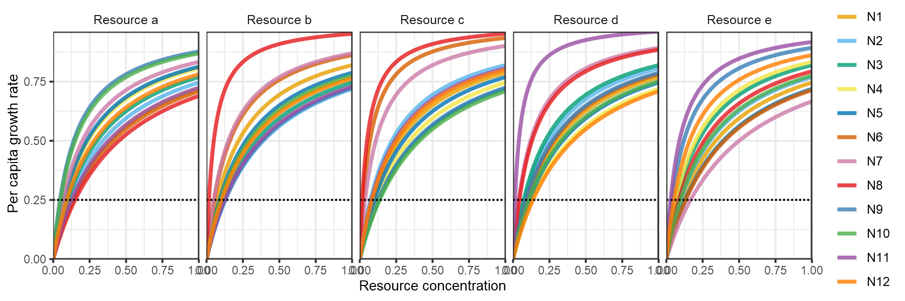
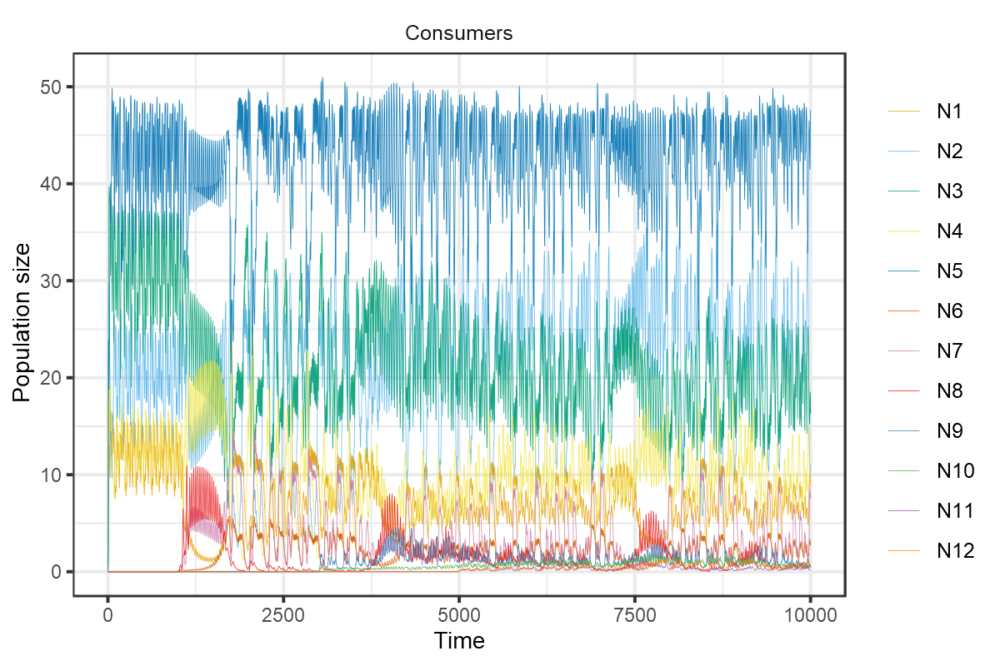
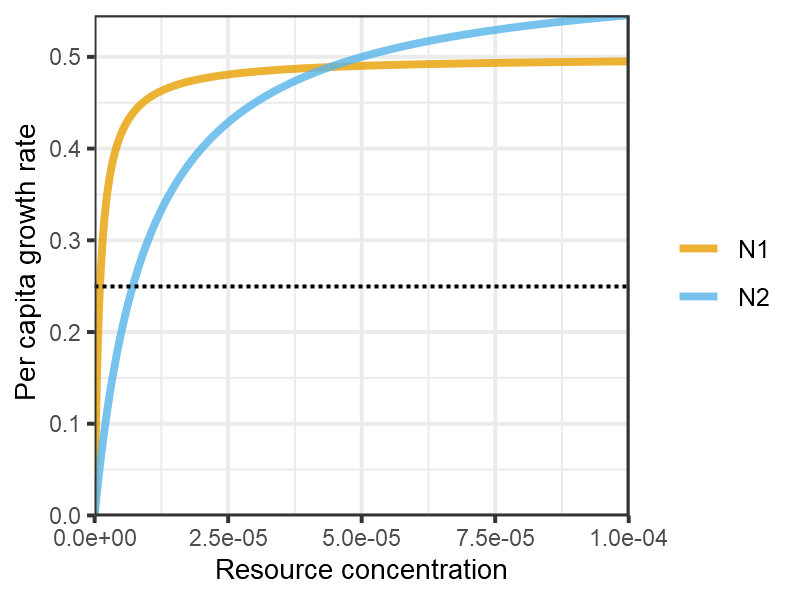

This vignette demonstrates the use of `rescomp` to reproduce a variety of analyses of resource competition from the literature.


```r
library(rescomp)
```


# Huisman and Weissing (1999)

[Biodiversity of plankton by species oscillations and chaos](https://www.nature.com/articles/46540). *Nature*, 402, 407–410

Huisman and Weissing (1999) is notable for showing how the osciallations and chaotic dynamics generated by consumers species competing for a limited number of resources can foster the coexistence of many more species than there are limiting resources. As a refutation of the competitive exclusion principal, this results provides one solution to the so-called 'paradox of the plankton'.


```r
pars <- spec_rescomp(
  spnum = 6,
  resnum = 3,
  funcresp = "type2",
  mumatrix = list(matrix(c(1, 1, 1,
                           1, 1, 1,
                           1, 1, 1,
                           1, 1, 1,
                           1, 1, 1,
                           1, 1, 1),
                         nrow = 6,
                         ncol = 3,
                         byrow = TRUE)),
  kmatrix = matrix(c(1.00, 0.30, 0.90,
                     0.90, 1.00, 0.30,
                     0.30, 0.90, 1.00,
                     1.04, 0.71, 0.46,
                     0.34, 1.02, 0.34,
                     0.77, 0.76, 1.07),
                   nrow = 6,
                   ncol = 3,
                   byrow = TRUE),
  qmatrix = matrix(c(0.04, 0.08, 0.14,
                     0.07, 0.08, 0.10,
                     0.04, 0.10, 0.10,
                     0.10, 0.10, 0.16,
                     0.03, 0.05, 0.06,
                     0.02, 0.17, 0.14),
                   nrow = 6,
                   ncol = 3,
                   byrow = TRUE),
  resspeed = 0.25,
  resconc = c(6, 10, 14),
  mort = 0.25,
  cinit = c(0.1 + 1/100, 0.1 + 2/100, 0.1 + 3/100, 0.1, 0.1, 0.1),
  essential = TRUE,
  totaltime = 15000,
  introseq = c(0, 0, 0, 1000, 2000, 5000)
)
#> Model properties 
#>  * 6 consumer(s) and 3 resource(s)
#>  * Consumers have type 2 functional responses
#>  * Resources are essential
#>  * Resource supply is continuous (e.g. chemostat)
#>  * Mortality is continuous
#> 
#> Simulation properties 
#>  * Simulation time: 15000 time steps
#>  * Init state: consumer(s) = [0.11, 0.12, 0.13, 0.1, 0.1, 0.1], resource(s) = [6, 10, 14]
#>  * Some or all consumers introduced after timepoint 0
```


```r
plot_funcresp(pars)
```




```r
m1 <- sim_rescomp(pars)
```


```r
plot_rescomp(m1, resources = FALSE)
```


```r
pars <- spec_rescomp(
  spnum = 12,
  resnum = 5,
  funcresp = "type2",
  mumatrix = matrix(c(1, 1, 1, 1, 1,
                      1, 1, 1, 1, 1,
                      1, 1, 1, 1, 1,
                      1, 1, 1, 1, 1,
                      1, 1, 1, 1, 1,
                      1, 1, 1, 1, 1,
                      1, 1, 1, 1, 1,
                      1, 1, 1, 1, 1,
                      1, 1, 1, 1, 1,
                      1, 1, 1, 1, 1,
                      1, 1, 1, 1, 1,
                      1, 1, 1, 1, 1),
                    nrow = 12, ncol = 5, byrow = TRUE),
  kmatrix = matrix(c(0.39, 0.22, 0.27, 0.30, 0.34,
                     0.34, 0.39, 0.22, 0.24, 0.30,
                     0.30, 0.34, 0.39, 0.22, 0.22,
                     0.24, 0.30, 0.34, 0.39, 0.20,
                     0.23, 0.27, 0.30, 0.34, 0.39,
                     0.41, 0.16, 0.07, 0.28, 0.40,
                     0.20, 0.15, 0.11, 0.12, 0.50,
                     0.45, 0.05, 0.05, 0.13, 0.26,
                     0.14, 0.38, 0.38, 0.27, 0.12,
                     0.15, 0.29, 0.41, 0.33, 0.29,
                     0.38, 0.37, 0.24, 0.04, 0.09,
                     0.28, 0.31, 0.25, 0.41, 0.16),
                   nrow = 12, ncol = 5, byrow = TRUE),
  qmatrix = matrix(c(0.04, 0.08, 0.10, 0.05, 0.07,
                     0.04, 0.08, 0.10, 0.03, 0.09,
                     0.07, 0.08, 0.10, 0.03, 0.07,
                     0.04, 0.10, 0.10, 0.03, 0.07,
                     0.04, 0.08, 0.14, 0.03, 0.07,
                     0.22, 0.14, 0.22, 0.09, 0.05,
                     0.10, 0.22, 0.24, 0.07, 0.24,
                     0.08, 0.04, 0.12, 0.06, 0.05,
                     0.02, 0.18, 0.03, 0.03, 0.08,
                     0.17, 0.06, 0.24, 0.03, 0.10,
                     0.25, 0.20, 0.17, 0.11, 0.02,
                     0.03, 0.04, 0.01, 0.05, 0.04),
       nrow = 12, ncol = 5, byrow = TRUE),
  resspeed = 0.25,
  resconc = c(6, 10, 14, 4, 9),
  mort = 0.25,
  cinit = c(0.1 + 1/100, 0.1 + 2/100, 0.1 + 3/100, 0.1 + 4/100, 0.1 + 5/100,
            0.1, 0.1, 0.1, 0.1, 0.1, 0.1, 0.1),
  essential = TRUE,
  totaltime = 10000,
  introseq = c(0, 0, 0, 0, 0,
               1000, 1000, 1000,
               3000, 3000,
               5000, 5000)
)
#> Model properties 
#>  * 12 consumer(s) and 5 resource(s)
#>  * Consumers have type 2 functional responses
#>  * Resources are essential
#>  * Resource supply is continuous (e.g. chemostat)
#>  * Mortality is continuous
#> 
#> Simulation properties 
#>  * Simulation time: 10000 time steps
#>  * Init state: consumer(s) = [0.11, 0.12, 0.13, 0.14, 0.15, 0.1, 0.1, 0.1, 0.1, 0.1, 0.1, 0.1], resource(s) = [6, 10, 14, 4, 9]
#>  * Some or all consumers introduced after timepoint 0
```


```r
plot_funcresp(pars)
```




```r
m1 <- sim_rescomp(pars)
```


```r
plot_rescomp(m1, resources = FALSE, lwd = 0.5)
```




# Grover (1990)

[Resource Competition in a Variable Environment: Phytoplankton Growing According to Monod's Model](https://www.journals.uchicago.edu/doi/abs/10.1086/285131). *The American Naturalist*, 136(6), 771-789.


```r
pars <- spec_rescomp(
  spnum = 2,
  resnum = 1,
  funcresp = "type2",
  mumatrix = list(matrix(c(0.5,
                           0.6),
                   nrow = 2,
                   ncol = 1,
                   byrow = TRUE)),
  kmatrix = matrix(c(0.000001,
                     0.00001),
                   nrow = 2,
                   ncol = 1,
                   byrow = TRUE),
  qmatrix = matrix(c(1/10^8,
                     1/10^8),
                   nrow = 2,
                   ncol = 1,
                   byrow = TRUE),
  resspeed = 0.25,
  resconc = 0.0002,
  mort = 0.25,
  cinit = 1000,
  totaltime = 100,
)
#> Model properties 
#>  * 2 consumer(s) and 1 resource(s)
#>  * Consumers have type 2 functional responses
#>  * Resource supply is continuous (e.g. chemostat)
#>  * Mortality is continuous
#> 
#> Simulation properties 
#>  * Simulation time: 100 time steps
#>  * Init state: consumer(s) = [1000, 1000], resource(s) = [2e-04]
```


```r
plot_funcresp(pars, maxx = 0.0001)
```




```r
mcons <- sim_rescomp(pars)
```


```r
plot_rescomp(mcons, resources = FALSE, logy = TRUE)
```


```r
period <- 1
amp <- ((0.0002*0.25*period)/(1 - exp(-0.25*period)) - 0.0002)*2
pars$respulse <- amp
pars$resconc <- 0
pars$rinit <- amp
pars$pulsefreq <- period
pars
#> Model properties 
#>  * 2 consumer(s) and 1 resource(s)
#>  * Consumers have type 2 functional responses
#>  * Resource supply is pulsed only (but continuously diluted)
#>  * Mortality is continuous
#> 
#> Simulation properties 
#>  * Simulation time: 100 time steps
#>  * Resources pulsing every 1 timesteps
#>  * Init state: consumer(s) = [1000, 1000], resource(s) = [5.20811664187798e-05]
```


```r
m1 <- sim_rescomp(pars)
plot_rescomp(m1, resource = FALSE, logy = TRUE)
```


```r
period <- 4
amp <- ((0.0002*0.25*period)/(1 - exp(-0.25*period)) - 0.0002)*2
pars$respulse <- amp
pars$rinit <- amp
pars$pulsefreq <- period
pars
#> Model properties 
#>  * 2 consumer(s) and 1 resource(s)
#>  * Consumers have type 2 functional responses
#>  * Resource supply is pulsed only (but continuously diluted)
#>  * Mortality is continuous
#> 
#> Simulation properties 
#>  * Simulation time: 100 time steps
#>  * Resources pulsing every 4 timesteps
#>  * Init state: consumer(s) = [1000, 1000], resource(s) = [0.000232790682747731]
```


```r
m4 <- sim_rescomp(pars)
plot_rescomp(m4, resource = FALSE, logy = TRUE)
```


```r
period <- 10
amp <- ((0.0002*0.25*period)/(1 - exp(-0.25*period)) - 0.0002)*2
pars$respulse <- amp
pars$rinit <- amp
pars$pulsefreq <- period
pars
#> Model properties 
#>  * 2 consumer(s) and 1 resource(s)
#>  * Consumers have type 2 functional responses
#>  * Resource supply is pulsed only (but continuously diluted)
#>  * Mortality is continuous
#> 
#> Simulation properties 
#>  * Simulation time: 100 time steps
#>  * Resources pulsing every 10 timesteps
#>  * Init state: consumer(s) = [1000, 1000], resource(s) = [0.000689425489833852]
```


```r
m10 <- sim_rescomp(pars)
plot_rescomp(m10, resource = FALSE, logy = TRUE)
```


# Armstrong and McGehee (1980)

[Competitive Exclusion](https://www.journals.uchicago.edu/doi/10.1086/283553). *The American Naturalist*, 115(2), 151-170.


```r
pars <- spec_rescomp(
  spnum = 2,
  resnum = 1,
  funcresp = c("type2", "type1"),
  mumatrix = matrix(c(0.5, 0.003),
                    nrow = 2,
                    ncol = 1,
                    byrow = TRUE),
  kmatrix = matrix(c(50, 1),
                   nrow = 2,
                   ncol = 1,
                   byrow = TRUE),
  effmatrix = matrix(c(0.3, 0.33),
                   nrow = 2,
                   ncol = 1,
                   byrow = TRUE),
  mort = c(0.1, 0.11),
  chemo = FALSE,
  resspeed = 0.1,
  resconc = 300,
  totaltime = 600,
  cinit = c(1,0.01),
  rinit = 100,
  introseq = c(0,194)
)
#> Model properties 
#>  * 2 consumer(s) and 1 resource(s)
#>  * Consumers have type 2 or type 1 functional responses
#>  * Resources grow logistically
#>  * Mortality is continuous
#> 
#> Simulation properties 
#>  * Simulation time: 600 time steps
#>  * Init state: consumer(s) = [1, 0.01], resource(s) = [100]
#>  * Some or all consumers introduced after timepoint 0
```


```r

# Using madj = TRUE standardizes the functional response by mortality.
plot_funcresp(pars, maxx = 200, madj = TRUE)
```


```r
m1 <- sim_rescomp(pars)
```


```r
plot_rescomp(m1)
```


<!-- # Hastings et al,. 2018. Transient phenomena in ecology. Science, 361(6406). -->
